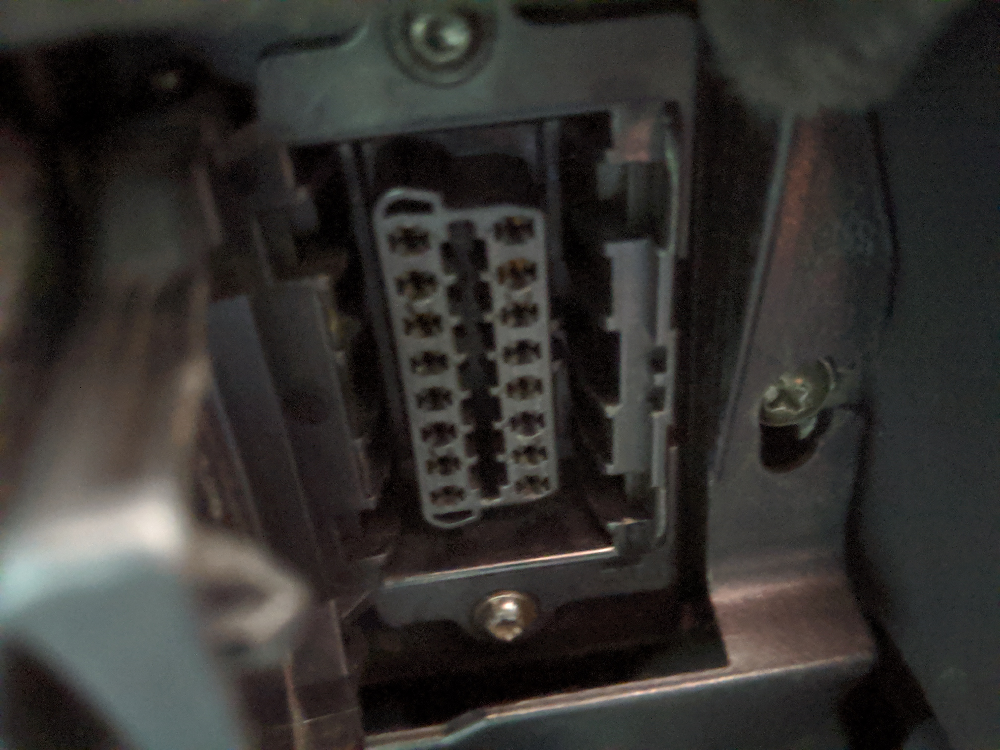
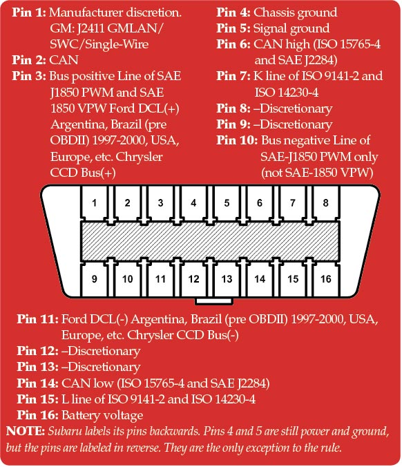

# My Random Car Hack & Exploration Mind Dump Secret Diary

## Tools and Hardware

Eric Evenchick is an animal and has created some epic hardware one can use on car exploration journeys. In 2016, he released the (CANtact)[https://linklayer.github.io/cantact/] which was an open source Controller Area Network (CAN) to USB interface for your computer. In 2019, he released a new version that offers dual CAN-FD based around a sweet 32-bit ARM Cortex-M4 microcontroller.

@nathancy created (Pi-CANtact)[https://github.com/nathancy/Pi-CANtact], a Python script to dump and send CAN data, then @finderman2 released (CANtools)[https://github.com/finderman2/CANtools]

## Methodology

First you need to work out what you actually have in your car. What type of CAN (there are many). Google is your friend, or by looking at the OBD-II port under the dash

The OBD Standard allows for (five)[https://en.wikipedia.org/wiki/On-board_diagnostics#OBD-II_signal_protocols] signalling protocols. To check which one your car has, look to see which pins are active (you might need a flash)

Once plugged in and with your laptop, you need to get Linux up and running. There's a few tools out there but for now, let's use can-utils:

`sudo apt-get install can-utils`

Then to initialise your hardware/CAN adapter, issue

`sudo modprobe can`

`sudo ip link set can0 up type can bitrate 500000`

1. cansniffer --> display only the packets that are changing
2. candump --> dump all received packets
3. cansend --> send a packet

### CAN Frames

Before you sniff traffic, you need to know what you are looking at. Most likely, it will be like so:

!(Received Can Frames)[images/candump.jpeg]

Seems hectic right? Well actually not that hectic, if you understand how the frames Network
!(CAN Frames)[images/CANframes.jpeg]

## GUI Tools

Thankfully there are now a host of GUI-based tools out there compared to previous years, I mostly use two: (Cantact App by Eric)[https://github.com/linklayer/cantact-app] and the amazing (SavvyCAN)[https://www.savvycan.com/]

!(Cantact-app)[images/CANtactapp.png]

### Blurbs I've not found a place for yet.

cansend can0 5A1#11.22.33.44.55.66.77.88
cansniffer -c can0

cansend can0 0C9#8021C0071B101000

0x7c
0x7B 0x7E

sudo modprobe can
sudo slcand -o -c -s6 /dev/ttyACM0 can0
sudo ifconfig can0 up
