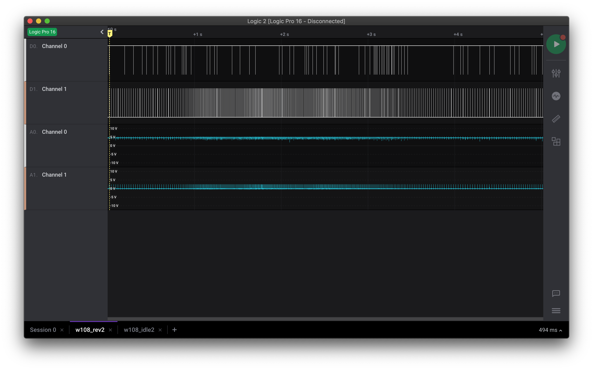

Here's a crazy idea, let's build a subtle tachometer (rev counter) for my 1972 Mercedes-Benz W108 280SE.

The idea isn't new and has been done many times, using many different approaches but you don't learn by just copying, at least in book. So the plan was to learn as much as I could about how this all works and this repo is that journey.

#### The Beginning

A tachometer works by reading the pulse generated from the coil. The coil takes 12V from the battery and opens and closes the points per crank revolution. In my case i've converted the car to electronic ignition from Pertronix but the same concept applies.

My engine, the M130, is a straight-six 2.8 litre so has 3 pulses per revolution.

Before we can read these pulses, we need to make the pulse safe to work with and also try and produce a proper square wave to read.  

#### Voltage Smoother©

Because the Pertronix has the capability to push out high voltage and this would fry a lot of equipment, there was a need to reduce this to around 5v. This looks something like this

The Bill of Materials (BOM) is as follows:

1. Zener diode
2. 1k Resistor
3. 370 Resistor
4. Zener Diode 5.1v
5. H111N 6-PIN DIP HIGH SPEED LOGIC OPTOCOUPLER
6. 290 Resistor (only needed to test the H111N is working)
7. Arduino Nano

The idea for the above is that we have potentially 14+v coming in from the coil. We need to drop that down to 5v before it hits the opto coupler on pin 1, and when we supply 3.3v from the Arduino, it will output a lovely square wave, which is better to read digitally. 

Using LTSpice to confirm this (it's a great tool if you haven't used it before) confirms it works in theory

Plugging in the Saleae, you can see this in action

Channel 0 is connected to the output of the octocoupler in which the Arduino will read the pulses. The sketch for this test is included. 

####PCB Design

Whilst an Arduino is being used to test this, I plan to use a Atmel 8-bit AVR, such as the Attiny85. 

####LED Display

The plan is to make use of two LED Bargraphs that fit into the slot where the automatic gear selector would usually go (mine is a manual)

